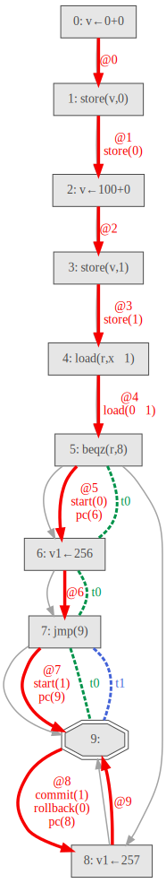

# specgraph
Tool for visualizing Spectector traces.

For more information about Spectector please visit https://spectector.github.io/

## Usage

Run Spectector and redirect the output into a file:

```
spectector loadsym.muasm -a reach1 -c 'c([], [pc=0,x=0])' | tee loadsym.txt
```

Then start `specgraph.py` with `loadsym.txt`:

```
python specgraph.py -i loadsym.txt -o loadsym
```

## Result


