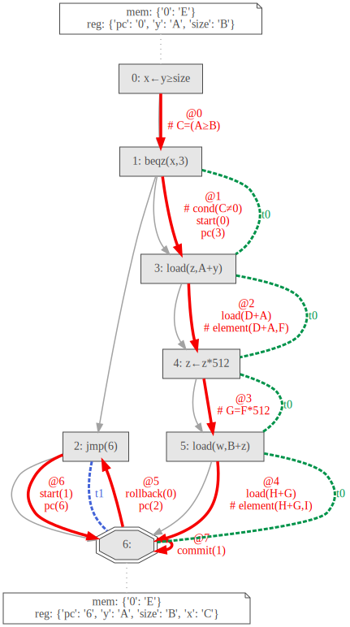

# specgraph
Tool for visualizing Spectector traces.

For more information about Spectector please visit https://spectector.github.io/

## Usage

Run Spectector and redirect the output into a file:

```
spectector loadsym.muasm -a reach1 -c 'c([], [pc=0,x=0])' | tee loadsym.txt
```

Then start `specgraph.py` with `loadsym.txt`:

```
python specgraph.py -i loadsym.txt -o loadsym
```

Or run Spectector and redirect the output to `specgraph.py` directly:

```
spectector p_2_5.muasm -a reach1 -c 'c([], [pc=0])' | python specgraph.py -o p_2_5
```

## Example

The Spectre v1 example from [Spectector: Principled Detection of Speculative Information Flows](https://spectector.github.io/papers/spectector.pdf) (Example 1):

```
    x<-y>=size
    beqz x,Within
    jmp End
Within:
    load z,A+y
    z<-z*512
    load w,B+z
End:
```

Gives the following graph:



* Rectangles correspond to the (labeled) instructions of the program. The octagon corresponds to the end of the program.
* Gray edges show the control flow of the program.
* Red edges depict the trace found by Spectector. Each edge is labeled with the logical timestamp (`@{number}`) as well as the observations of the executed instruction.
* Dashed edges visualize the uncommitted speculative transactions along the trace.
